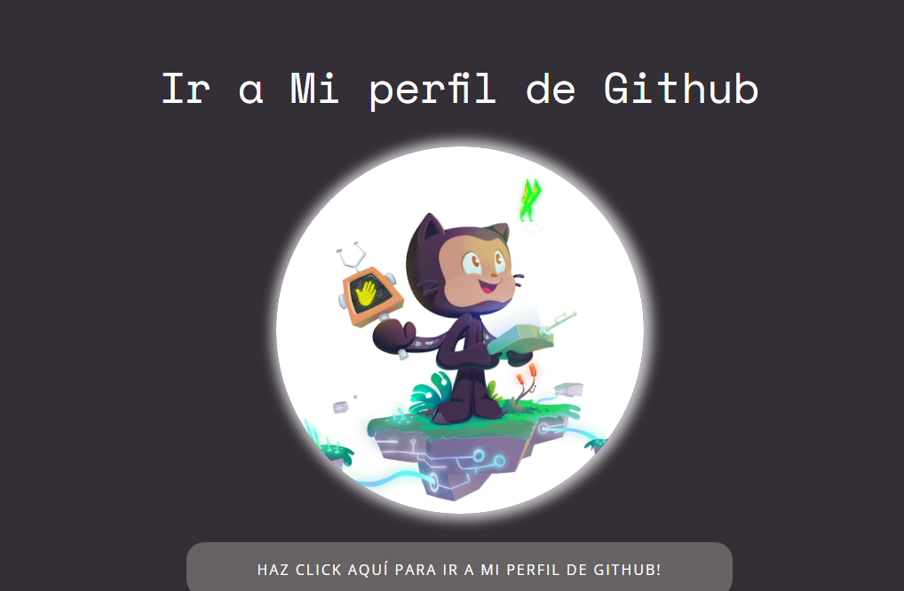

Este repositorio contiene el proyecto desafío evaluado y obligatorio del módulo 2 llamado Fundamentos del desarrollo front-end de la beca Full Stack Javascript Trainee V2.0 de Talento Digital para Chile dictada por DesafioLatam que consiste en:

<ol text-align='center'>
    <li>Crear un repositorio local usando git</li>
    <li>Crear una rama</li>
    <li>Moverse a esa rama</li>
    <li>Realizar cambios a un proyecto en esa nueva rama</li>
    <li>Hacer merge de ramas</li>
    <li>Crear un repositorio remoto en github</li>
    <li>Subir el repositorio local al repositorio remoto</li>
</ol>

Se nos entrega un proyecto no terminado y con errores el cual se ve de esta manera:

Se nos pide realizar cambios en una nueva rama y cuando se haya finalizado la realización de cambios se debe fusionar la rama nueva con la rama principal. Mi proyecto listo quedo de esta manera:

